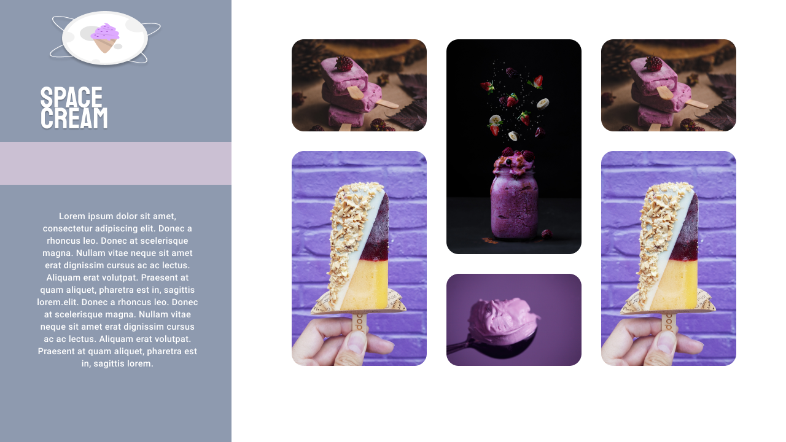

# Space Creams

The challenge is to create a page, using grid and animations.

 

  <a href="#-technologies">Technologies</a>&nbsp;&nbsp;&nbsp;|&nbsp;&nbsp;&nbsp;
  <a href="#-project">Project</a>

## 🚀 Technologies

This project was developed  with the following technologies:

- HTML
- CSS
- JavaScript

## Project

Apprenticeship

- Grid
- Animations e transactions
- Media queries

&nbsp;

## License

This project is licensed under 
[MIT](https://choosealicense.com/licenses/mit/)

&nbsp;

Done with 💜 by Jonas Martins👋

